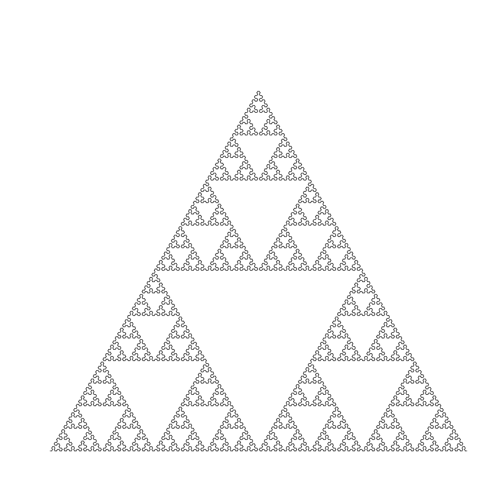
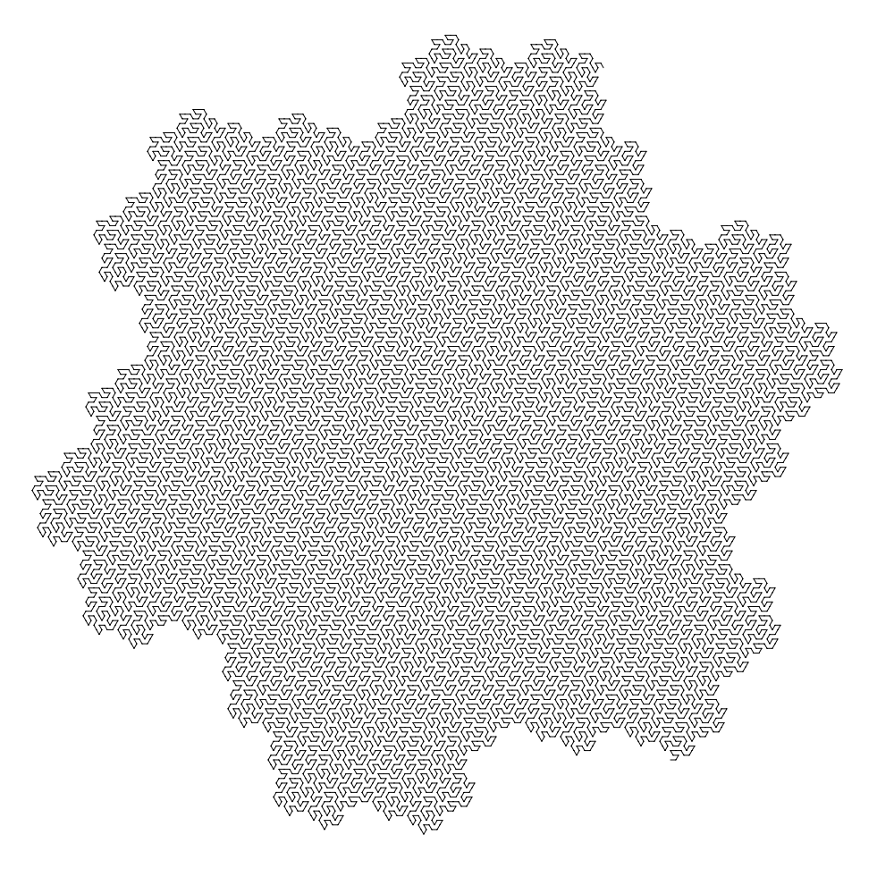

### About

Code for rendering some simple L-systems. Same as [my earlier attempt in C++](https://github.com/ajnirp/lsystem), but instead of using OpenGL 2, it uses the excellent GG [library](https://github.com/fogleman/gg) by Michael Fogleman. This results in renders with less aliasing.

### Build

```
go get github.com/fogleman/gg
go build
```

### Run

```./lsystem_go```

### Outputs

Sierpinski triangle


Hexagonal gosper curve
